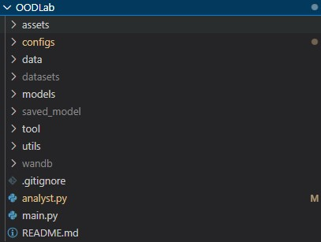
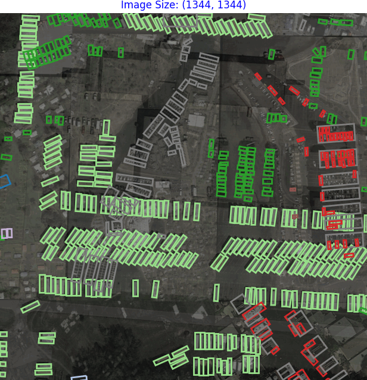
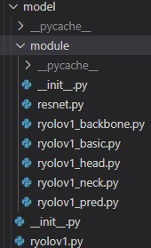

# Real-Time Oriented Object Detection
This repository is a curated and customized collection of deep learning applications for oriented object detection.
As a Computer Vision researcher, I’ve redesigned the model and data structures for clarity and flexibility, making it ideal for research and prototyping.

## Info
+ The repository includes RYOLO versions from RYOLOv1 to RYOLOv11 and RYOLOX.
+ The dataset supports data processing in the following formats: VOC, COCO, YOLO, ICDAR.
+ Dataset augmentation options include YOLO-style augmentation (yolo_aug) and SSD-style augmentation (ssd_aug).
+ Model training is monitored using Weights & Biases (wandb), making it easier to observe overfitting or underfitting behaviors.
+ Data augmentation at multiple image sizes, configurable via YAML, helps models generalize better and improves overall performance.
+ Model structure is refactored into a clear pipeline: `backbone -> neck -> head -> predict`, making the code more readable and easier to modify.
+ Multiple bounding box loss functions from various papers are supported and can be selected in the config file, such as: `iou`, `ciou`, `probiou` and `fpdiou`.
+ Model performance evaluation is available using mAP metrics and confusion matrix analysis.
+ After training, models can be exported to ONNX format for accelerated inference on various deployment platforms.

## Research Models


## Structure



## Demo
Dataset Augmentation:
+ SSD Augmentation


+ Yolo Augmentation


Example RYOLOv1 Config File



Example RYOLOv1 Model Structure

🔧 See full [RYOLOv1 config example here](assets/dota.yaml)

Model Performance Evaluation
+ mAP metric:
<p align='center'>
    
</p>

+ Confusion matrix:
<p align='center'>
    
</p>

## Demo

### Train
```bash
python main.py --yaml_config configs/ryolov1/dota.yaml
```

### Test .pth & .onnx Model
```bash
voila "test_model.ipynb" --port 8866 --Voila.ip 127.0.0.1 --show_tracebacks=True
```

## Installation

To use these applications, you need to have Python and several Python packages installed. To install the required packages, use the following command:
```bash
pip install -r requirements.txt"
```