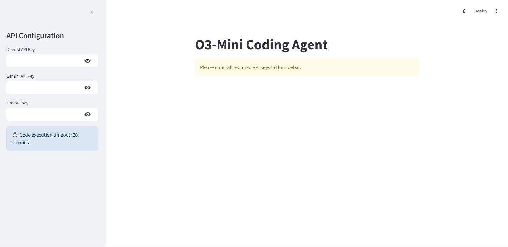

# 💻 Multimodal AI Coding Agent Team with o3-mini and Gemini
An AI Powered Streamlit application that serves as your personal coding assistant, powered by multiple Agents built on the new o3-mini model. You can also upload an image of a coding problem or describe it in text, and the AI agent will analyze, generate an optimal solution, and execute it in a sandbox environment.

## Demo


## Features
#### Multi-Modal Problem Input
- Upload images of coding problems (supports PNG, JPG, JPEG)
- Type problems in natural language
- Automatic problem extraction from images
- Interactive problem processing

#### Intelligent Code Generation
- Optimal solution generation with best time/space complexity
- Clean, documented Python code output
- Type hints and proper documentation
- Edge case handling

#### Secure Code Execution
- Sandboxed code execution environment
- Real-time execution results
- Error handling and explanations
- 30-second execution timeout protection

#### Multi-Agent Architecture
- Vision Agent (Gemini-2.0-flash) for image processing
- Coding Agent (OpenAI- o3-mini) for solution generation
- Execution Agent (OpenAI) for code running and result analysis
- E2B Sandbox for secure code execution

## How to Run

Follow the steps below to set up and run the application:
- Get an OpenAI API key from: https://platform.openai.com/
- Get a Google (Gemini) API key from: https://makersuite.google.com/app/apikey
- Get an E2B API key from: https://e2b.dev/docs/getting-started/api-key

1. **Install the dependencies**
    ```bash
    pip install -r requirements.txt
    ```

2. **Run the Streamlit app**
    ```bash
    streamlit run ai_coding_agent_o3.py
    ```

3. **Configure API Keys**
   - Enter your API keys in the sidebar
   - All three keys (OpenAI, Gemini, E2B) are required for full functionality

## Usage
1. Upload an image of a coding problem OR type your problem description
2. Click "Generate & Execute Solution"
3. View the generated solution with full documentation
4. See execution results and any generated files
5. Review any error messages or execution timeouts